## Salut, moi c'est Chaabane 

Étudiant en **M2 Machine Learning & Data Mining** à l'Université Jean Monnet (Saint-Étienne), dans un master international enseigné en anglais.

Je cherche un **stage de fin d'études de 6 mois à partir de février 2027**, en Data / IA, ML engineering ou NLP.

Ce qui me plaît, c'est passer d'une question floue à une réponse chiffrée et défendable, et comprendre *pourquoi* des données ou un modèle se trompent plutôt que me contenter d'un bon score.

## 🚀 Projet phare, un assistant IA juridique

[**legal-ai**](https://github.com/Fryzim/legal-ai) est un assistant de questions-réponses en français qui répond à des questions de droit en citant l'article de loi utilisé. Projet de recherche de Master mené en binôme d'avril à août 2026, entièrement from scratch, de l'état de l'art jusqu'à la documentation.

- 🔎 **RAG complet** avec indexation hybride (embeddings multilingues + BM25), fusion RRF et reranker cross-encoder sur Mistral-7B
- 🧪 **Fine-tuning QLoRA** de Mistral-7B sur un seul GPU T4, 7 variantes testées
- 📏 **Évaluation rigoureuse** avec intervalles de confiance bootstrap, tests appariés corrigés et évaluation humaine en aveugle à 3 annotateurs
- 🧹 **Qualité des données**, deux défauts silencieux détectés et corrigés, dont 32 % d'identifiants au format incohérent

## 📌 Autres projets

| Projet | Ce que ça montre | Stack |
|---|---|---|
| [**Mining Film Appreciation Patterns**](https://github.com/Fryzim/Mining-Film-Appreciation-Patterns-in-Letterboxd-Dataset) | 94 159 films Letterboxd analysés. Les vieux films sont mieux notés à cause d'un biais de survie, pas d'une meilleure qualité (r = −0,86 entre volume et note par décennie). Règles d'association, k-means, forêts aléatoires | `R` `dplyr` |
| [**Automobile-analysis**](https://github.com/Fryzim/Automobile-analysis) | 392 voitures de 1970 à 1982 face aux chocs pétroliers. Le poids est le premier facteur de consommation, et la part de modèles conformes à la norme CAFE passe d'environ 20 % à plus de 80 %. ACP, régression polynomiale | `pandas` `scikit-learn` |
| [**benchmarking_knapsack01**](https://github.com/Fryzim/benchmarking_knapsack01) | 16 algorithmes comparés pour le sac à dos 0/1 (exacts, FPTAS, greedy, métaheuristiques) sur plus de 1000 instances | `Python` `NumPy` |
| [**KNN-Classifier**](https://github.com/Fryzim/KNN-Classifier) | k-NN codé from scratch, avec 3 optimisations comparées (distances précalculées, inégalité triangulaire, kd-tree) | `Python` `SciPy` |

## 🛠️ Stack

## 🎯 En dehors du code

- 🎬 **Cinéma**, assez pour avoir miné un dataset Letterboxd juste pour comprendre ce qui rend un film culte plutôt que moyen
- 📚 **Littérature étrangère**, Dostoïevski, Kafka, Wilde
- 🗣️ **Langues**, français, anglais, notions d'espagnol, et le japonais en autodidacte avec le JLPT N5 en ligne de mire
- ⚽ **Football**, joueur et spectateur
- 🍲 **Cuisine marocaine**, et l'exigence d'un tajine réussi
- 🥾 **Randonnée**

 

*Un stage en data ou en IA en tête ? Écrivez-moi, je réponds vite.*

